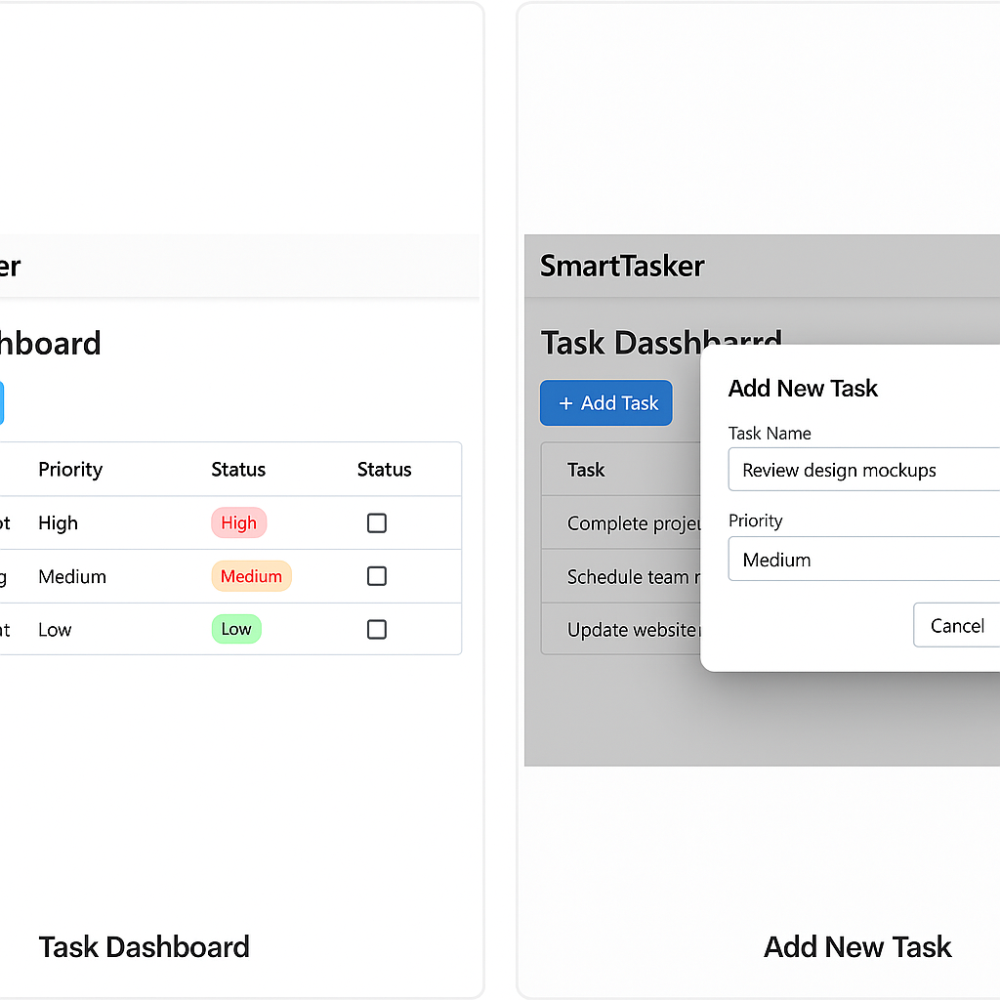

# SmartTasker – Productivity Task App

SmartTasker is a full-stack task management web app built with Angular and .NET Core. It allows users to create, manage, and prioritize daily tasks with a clean and responsive interface.


## 🚀 Features
- Add, update, delete tasks
- Set priority: Low, Medium, High
- Toggle task completion
- RESTful backend API with Entity Framework
- Fully responsive Angular frontend

## 🖥️ UI Screenshots

### 📋 Task Dashboard


### ➕ Add New Task


## 🧱 Tech Stack
- **Frontend**: Angular 15+
- **Backend**: ASP.NET Core 8, Entity Framework
- **Database**: SQL Server

## 📂 Project Structure
```
client/     # Angular frontend
server/     # ASP.NET Core backend
```

## 🛠️ Setup

### Backend (.NET Core)
```bash
cd server
dotnet restore
dotnet ef database update
dotnet run
```

### Frontend (Angular)
```bash
cd client
npm install
ng serve
```

## 📄 License
MIT
